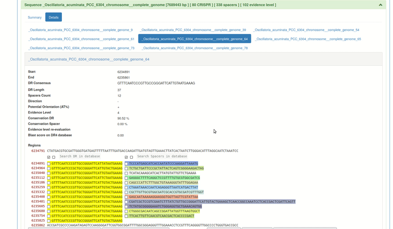

# SpacerPlacer


SpacerPlacer is a powerful software for reconstructing ancestral CRISPR spacer arrays along a given phylogenetic tree.
SpacerPlacer is respecting the chronological timeline of spacer insertions as defined by the order of spacers within the CRISPR arrays and uses this additional information to improve the ancestral reconstruction.


## Features

- **Ancestral Spacer Array Reconstruction:** SpacerPlacer allows you to reconstruct ancestral CRISPR spacer arrays based on a given phylogenetic tree.
- **Identification of Ancestral Spacer Acquisitions, Deletions, Duplications, and Rearrangements:** The tool identifies ancestral duplications and rearrangements within the CRISPR array.
- **Spacer Deletion Rate Estimation:** The software provides an estimation of spacer deletion rates within the CRISPR arrays.
- **Analysis of Jointly Lost Spacers:** SpacerPlacer calculates the average length of blocks of jointly lost spacers in the array.
- **optional: Phylogenetic Tree Reconstruction:** In addition to spacer array reconstruction along a given tree, SpacerPlacer can also reconstruct phylogenetic trees based on the CRISPR spacer data.


## Conference Posters

We presented posters at the conference CRISPR2023, showcasing the features and applications of SpacerPlacer and the related CRISPR-evo-inator tool to predict the direction of transcription of CRISPR arrays. You can find the PDF versions of the posters below:

- [SpacerPlacer Poster](doc/posters/crispr2023_spacerplacer.pdf)
- [CRISPR-evo-inator Poster](doc/posters/crispr2023_CRISPRevoinator.pdf)

Please feel free to explore the posters to learn more about SpacerPlacer and its applications.


## Code Availability

We are currently in the process of preparing the code for SpacerPlacer and will soon be adding it to this repository. We appreciate your patience!

To stay up to date with the latest developments, we recommend bookmarking this repository and checking back periodically for updates.

Alternatively, you can reach out to us via email at axel.fehrenbach@uni-tuebingen.de to express your interest in SpacerPlacer. We will be happy to notify you once the code becomes available.

Thank you for your interest in SpacerPlacer!


However, if you want to already prepare your input data here is what SpacerPlacer requires as an input:


## Input data preparation

### Initial steps
Currently SpacerPlacer requires CRISPRcasFinder output format.
To get files in this format you can e.g. submit the gemonic sequences to the CRISPRcasFinder web server.


You then need to carefully select the output CRISPR array and place them into two folders
CRISPRcasFinder interface is capable of predicting the orientation but alwas provides the spacers from the forward strand.
Be aware that since CRISPRcasFinder predicts the orientation internally the consensus repeat will appear different in the output.





CRISPRcasFinder only provides the forward strand output. So in order to ensure the correct representation 
you need to place all the files from the forward strand into the "forward" directory.
And all the files from the reverse strand into the "reverse" directory. 


### Input data format
The standard input format is a folder containing two subfolders "forward" and "reverse".
Each subfolder contains the CRISPRcasFinder output for the corresponding strand.
The CRISPRcasFinder output is a set of files in fasta format containing only the spacers from the corresponding CRISPR arrays.


## Installation

(installation instructions are currently not up to date)

To install SpacerPlacer, follow these steps:

1. Clone the GitHub repository:

   ```bash
   git clone https://github.com/fbaumdicker/SpacerPlacer.git
   ```
   
2. Navigate to the cloned repository and install the required dependencies:

   ```bash
    cd SpacerPlacer
    pip install -r requirements.txt
   ```
